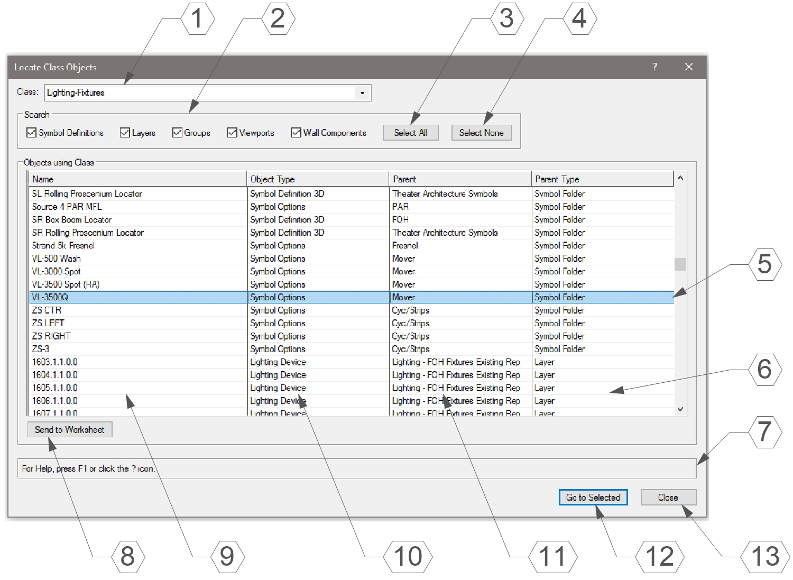
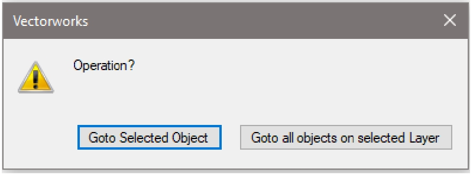
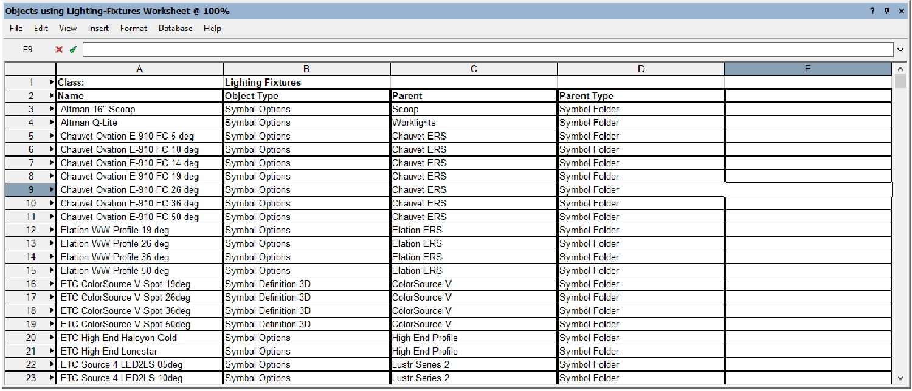

c# Locate Class Objects

Menu Command

## Version

1.0.1 - 5/10/2023

This plug-in is written in Vectorscript (Pascal) and can be used in any version of [Vectorworks](https://www.vectorworks.net/) 2019 or newer.

## Description

Opens a dialog box showing all instances of a Class in the current drawing. This can range from geometry within Symbol Definitions, Symbol Options such as **Assign to Class**, or Classes defined within Wall Components. Designed to track down errant objects when attempting to delete Classes.

## Instructions

1. Run the **Locate Class Objects** menu command.
2. Select a Class from the **Class** drop-down menu at the top of the dialog box. This will default to the active Class.
3. Select the objects to search through by manipulating the checkboxes in the **Search** box.
4. Press **Send to Worksheet** to send results to a Worksheet for investigation outside of the dialog box.
5. Press the **Go to Selected** button to close the dialog box and navigate to the object selected in the List Browser.
6. Press **Close** to close the dialog box.

## Dialog Box Explanation

1. Drop-down menu to select chosen Class. This will default to the currently active Class.
2. Check boxes to determine items to search for uses of chosen Class.
3. Press the **Select All** button to select all possible search options.
4. Press the **Select None** button to deselect all possible search options.
5. The currently selected object will be highlighted in the List Browser. Only one object may be selected at a time.
6. Column listing the object's parent type.
7. **Help Box**, mousing over any dialog box element will display an explanation here.
8. Press **Send to Worksheet** to send the current results to a Worksheet to investigate objects outside of using this dialog box.
9. Column listing the object's name when applicable.
10. Column listing the object's type.
11. Column listing the object's parent name. Parents can include Symbol Definitions, Layers, Resource Folders, and Walls.
12. Press **Go to Selected** to navigate to the selected item. This will open the edit container of Symbol Definitions, Groups, and Viewport Annotations/Crops, or will navigate to the object's current Layer and select the object.
13. Press **Close** to close the dialog box.

When selecting an object located on a Layer, you will be given the option to go to that object's Layer and select the object, or to go to that object's Layer and select all objects on that Layer matching the chosen class.

## Worksheet Example

When the **Send to Worksheet** button is pressed, a Worksheet will be generated containing the results currently listed in the List Browser. This can be helpful to track down objects without having to run the menu command multiple times.

The columns mimic the columns found in the List Browser, with an added fifth column displaying the object's UUID.

## Installation Instructions

There are two methods of installation, direct download of the plug-in or through the **JNC Tools Free Manager** plug-in.

### Direct Download:

1. Download [source plug-in file](Locate%20Class%20Objects.vsm)
2. Place downloaded file inside the **Vectorworks User Folder** within the **Plug-ins** directory
3. Restart Vectorworks

### JNC Tools Free Manager

1. Run the [**JNC Tools Free Manager**](https://jncogs.github.io/JNC-Tools-Manager-Free/) menu command
2. Select the **Locate Class Objects** command
3. Press the **Install / Update** button
4. Press **Close** to close the dialog box
5. Restart Vectorworks

## Adding the Plug-in to your Workspace

1. Open the **Workspace Editor** by going to **Tools - Workspaces - Edit Current Workspace**
2. Select the **Menus** tab
3. In the box on the left, find and expand the **JNC** category
4. In the box on the right, find a suitable menu to place the command in, such as **Tools** or **Modify**
5. Click and drag the **Locate Class Objects** command from the box on the left to the desired menu location in the box on the right
6. Click **OK** to close the editor

## Localization Instructions

The plug-in can be localized to your native language without having access to the source code.  This can be achieved by following the instructions below:

1. Open the **Plug-in Manager** by going to **Tools - Plug-ins - Plug-in Manager**
2. Select the **Third-party Plug-ins** tab
3. Select the **Locate Class Objects** command
4. Click the **Customize** button
5. Select the **Strings** tab
6. Double-click a category, such as **Dialog Strings**
7. Select a string to edit and press the **Edit** button
8. Write a new string and press the **OK** button until you are back to the **Plug-in Manager**

The categories for this plug-in are as follows:

- **3000** - *Dialog Strings*: These strings are used in the dialog box and can all freely be changed.
- **4000** - *Dialog Help Strings*: These strings are used in the Help Box at the bottom of the dialog box and can all freely be changed.
- **5000** - *Misc Strings*: These strings serve multiple purposes in the code, mostly relating to object details and auxiliary dialogs. These strings can all freely be changed.
- **6000** - *Object Types*: These strings are used to translate the object type numbers given by **GetType** to the object name as defined by the [Vectorscript Appendix D](https://developer.vectorworks.net/index.php?title=VS:Function_Reference_Appendix_D). These strings can be changed to match the localization of such types in a localized version of Vectorworks.

## Release Notes

| Date | Version | Note |
| :---: | :---: | :--- |
| 07/19/2022 | 1.0.0 | Initial release |
| 10/30/2022 | 1.0.1 | Added clarification for objects located in symbols and traversal options |
| 05/10/2023 | 1.0.1 | Added Version Control (no other changes) |

## Known Bugs

No Known Bugs

## Feature Requests

| Date Logged | Request |
| :---: | :--- |
| 09/01/2024 | Add ability to search Wall Styles |
| 09/01/2024 | Add ability to search PIO class parameters |
| 06/27/2025 | Add ability to traverse object history |

## License

Copyright (c) Jesse Cogswell (JNC Tools)

Permission is hereby granted, free of charge, to any person or organization
obtaining a copy of this software (the "User") and associated documentation files (the "Software"),
to use, reproduce, distribute, execute, and transmit the Software.

The User is not permitted to modify or attempt to reverse engineer the source code.  The User may
localize the Software using approved methods from within the Vectorworks software.

THE SOFTWARE IS PROVIDED "AS IS", WITHOUT WARRANTY OF ANY KIND, EXPRESS OR
IMPLIED, INCLUDING BUT NOT LIMITED TO THE WARRANTIES OF MERCHANTABILITY,
FITNESS FOR A PARTICULAR PURPOSE, TITLE AND NON-INFRINGEMENT. IN NO EVENT
SHALL THE COPYRIGHT HOLDERS OR ANYONE DISTRIBUTING THE SOFTWARE BE LIABLE
FOR ANY DAMAGES OR OTHER LIABILITY, WHETHER IN CONTRACT, TORT OR OTHERWISE,
ARISING FROM, OUT OF OR IN CONNECTION WITH THE SOFTWARE OR THE USE OR OTHER
DEALINGS IN THE SOFTWARE.